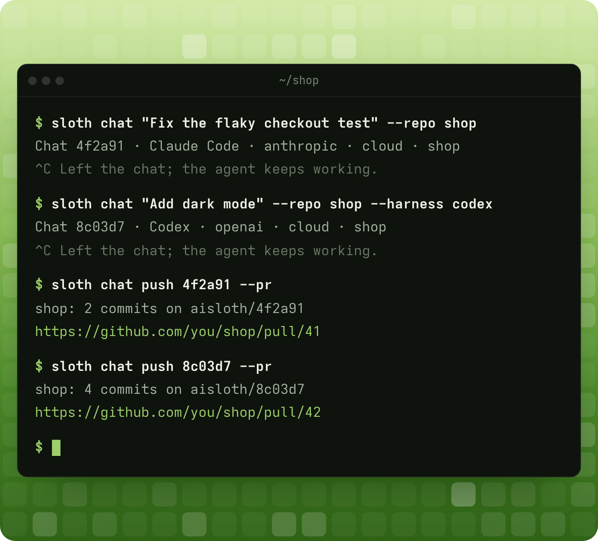

<p align="center">
  
</p>

# Ai~~Slop~~Sloth

**Every coding agent gets its own computer.**

Start as many agents as you need, each on a computer of its own, ready in seconds. They keep working
while your laptop sleeps, and one command turns their work into a pull request. Claude Code, Codex,
GitHub Copilot and pi, with your own accounts.

```sh
curl -fsSL https://aisloth.dev/install.sh | sh
```

For Linux and Macs with Apple silicon; on Windows, in WSL. Then `sloth help`.

## Why AiSloth

- **One agent, one computer.** No shared checkout, no agents fighting over files, ports or Docker.
  Each gets an isolated computer of its own, with Docker inside.
- **Ready in seconds.** Set a repository up once; every new agent starts with everything installed.
- **Close the lid.** Agents run in the cloud or on your machines, not in your terminal. Come back to
  pull requests.
- **Any agent, your accounts.** Claude Code, Codex, GitHub Copilot and pi run natively. Your API keys
  never enter an agent's computer.
- **Rewind any turn.** Every turn is saved; start a new agent from any of them.
- **Made for teams.** Share a workspace, its repositories, secrets and instructions.

## Run it your way

- **Hosted.** The easiest way: no servers, no Docker, nothing to maintain. We run it at
  [aisloth.dev](https://aisloth.dev), in early beta.
- **On your machines.** Connect a Linux box, a VPS or a Windows PC in WSL with `sloth machine`, and
  agents run there, still isolated.
- **Self-hosted.** Run all of AiSloth in your own cloud: [docs/self-hosting.md](docs/self-hosting.md).

## Built in the open

AiSloth is built in the open by [Aleksandr Bagatka](https://github.com/bagatka)
([@alex_bagatka](https://x.com/alex_bagatka)). Follow [@AiSlothDev](https://x.com/AiSlothDev) for
news, star the repo if you want more agents and less slop, and fork away: [CONTRIBUTING.md](CONTRIBUTING.md)
takes you from clone to running in a few commands.

[MIT](LICENSE). The landing page's fonts keep their own SIL Open Font License.
